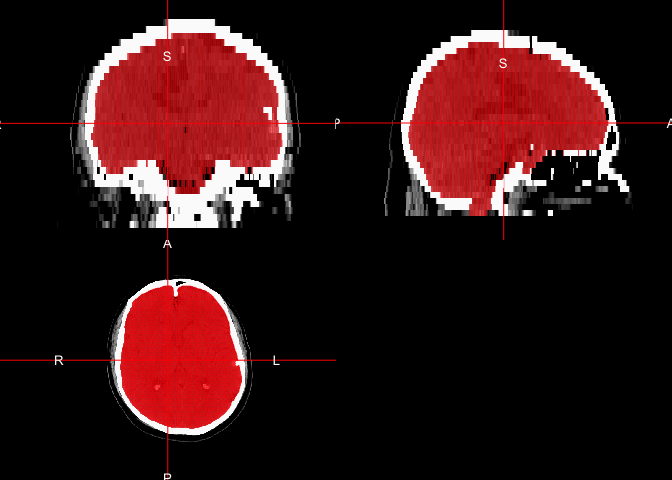
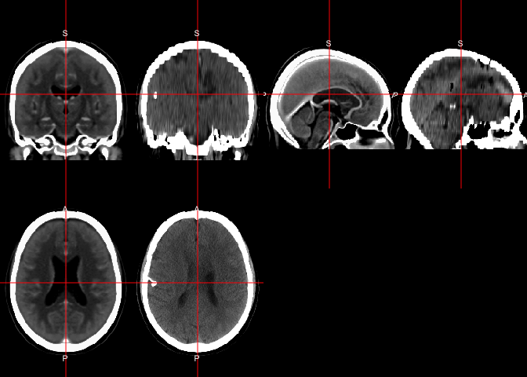
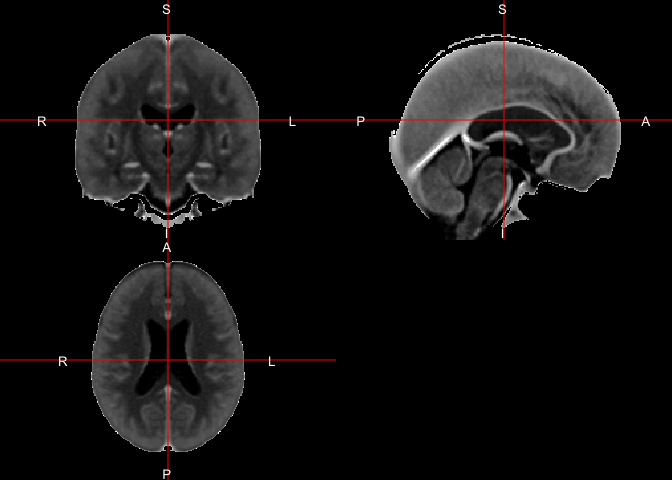

# Goal
In this tutorial, we will discuss skull-stripping (or brain-extracting) x_ray computed tomography (CT) scans.  We will use data from TCIA (http://www.cancerimagingarchive.net/) as there is a great package called [`TCIApathfinder`](https://CRAN.R-project.org/package=TCIApathfinder) to interface with TCIA.

## Using TCIApathfinder

In order to use `TCIApathfinder`, please see the [vignette to obtain API keys](https://cran.r-project.org/web/packages/TCIApathfinder/vignettes/introduction.html).  Here we will look at the collections:


```r
library(TCIApathfinder)
library(dplyr)
series_instance_uid = "1.3.6.1.4.1.14519.5.2.1.2857.3707.893926543922125108620513439908"
download_unzip_series = function(series_instance_uid,
                                 verbose = TRUE) {
  tdir = tempfile()
  dir.create(tdir, recursive = TRUE)
  tfile = tempfile(fileext = ".zip")
  tfile = basename(tfile)
  if (verbose) {
    message("Downloading Series")
  }
  res = save_image_series(
    series_instance_uid = series_instance_uid, 
    out_dir = tdir, 
    out_file_name = tfile)
  if (verbose) {
    message("Unzipping Series")
  }  
  stopifnot(file.exists(res$out_file))
  tdir = tempfile()
  dir.create(tdir, recursive = TRUE)
  res = unzip(zipfile = res$out_file, exdir = tdir)
  L = list(files = res,
           dirs = unique(dirname(normalizePath(res))))
  return(L)
}
# Download and unzip the image series

file_list = download_unzip_series(
  series_instance_uid = series_instance_uid)
```

```
Downloading Series
```

```
Unzipping Series
```

## Converting DICOM to NIfTI

We will use [`dcm2niix`](https://github.com/rordenlab/dcm2niix) to convert from DICOM to NIfTI.  The function `dcm2niix` is wrapped in `dcm2niir`.  We will use `dcm2niir::dcm2nii` to convert the file.  We use `check_dcm2nii` to grab the relevant output files:
 

```r
library(dcm2niir)
dcm_result = dcm2nii(file_list$dirs)
```

```
#Copying Files
```

```
# Converting to nii 
```

```
'/Library/Frameworks/R.framework/Versions/3.5/Resources/library/dcm2niir/dcm2niix' -9 -z y -f %p_%t_%s '/var/folders/1s/wrtqcpxn685_zk570bnx9_rr0000gr/T//RtmppxXJQQ/filecf7c7782517b'
```

```r
dcm_result$nii_after
```

```
[1] "/var/folders/1s/wrtqcpxn685_zk570bnx9_rr0000gr/T//RtmppxXJQQ/filecf7c7782517b/HEAD_STD_20010124161800_2_Tilt_1.nii.gz"
[2] "/var/folders/1s/wrtqcpxn685_zk570bnx9_rr0000gr/T//RtmppxXJQQ/filecf7c7782517b/HEAD_STD_20010124161800_2.nii.gz"       
```

```r
result = check_dcm2nii(dcm_result)
result
```

```
[1] "/var/folders/1s/wrtqcpxn685_zk570bnx9_rr0000gr/T//RtmppxXJQQ/filecf7c7782517b/HEAD_STD_20010124161800_2_Tilt_1.nii.gz"
attr(,"json_file")
[1] "/var/folders/1s/wrtqcpxn685_zk570bnx9_rr0000gr/T//RtmppxXJQQ/filecf7c7782517b/HEAD_STD_20010124161800_2.json"
```

Here we read the data into `R` into a `nifti` object:

```r
library(neurobase)
img = readnii(result)
ortho2(img)
```

<!-- -->

```r
range(img)
```

```
[1] -3024  3071
```

Here we will use `neurobase::rescale_img` to make sure the minimum is $-1024$ and the maximum is $3071$.  The minimum can be lower for areas outside the field of view (FOV).  Here we plot the image and the Winsorized version to see the brain tissue:


```r
img = rescale_img(img, min.val = -1024, max.val = 3071)
ortho2(img)
```

<!-- -->

```r
ortho2(img, window = c(0, 100))
```

<!-- -->

## Skull Strip

We can skull strip the image using `CT_Skull_Strip` or `CT_Skull_Stripper`.  The `CT_Skull_Stripper` has a simple switch to use `CT_Skull_Strip` or `CT_Skull_Strip_robust`.  

```r
library(ichseg)
ss = CT_Skull_Strip(img, verbose = FALSE)
```

```
Warning in get.fsl(): Setting fsl.path to /usr/local/fsl
```

```
Warning in get.fsloutput(): Can't find FSLOUTPUTTYPE, setting to NIFTI_GZ
```

```r
ortho2(img, ss > 0, 
       window = c(0, 100),
       col.y = scales::alpha("red", 0.5))
```

<!-- -->

The `CT_Skull_Strip_robust` function does 2 neck removals using `remove_neck` from `extrantsr` and then find the center of gravity (COG) twice to make sure the segmentation focuses on the head.  In some instances, the whole neck is included in the scan, such as some of the head-neck studies in TCIA.

## Registration

Here we register the image to the template image from Rorden (2012).  We will use the `registration` function from the `extrantsr` package.  The `extrantsr` package uses the `ANTsR` package to perform the registration, and simply wraps multiple commands together.  We will use a Symmetric Normalization (SyN) type of registration, which first uses an affine registration, then combines it with a symmetric non-linear diffeomorphism.  The output file `reg$outfile` is the registered image.


```r
template_image = ichseg::ct_template(type = "image")
ortho2(template_image, window = c(0, 100))
```

<!-- -->

```r
reg = extrantsr::registration(
  img, template.file = template_image, 
  typeofTransform = "SyN", 
  interpolator = "Linear")
```

```
# Running Registration of file to template
```

```
# Applying Registration output is
```

```
$fwdtransforms
[1] "/var/folders/1s/wrtqcpxn685_zk570bnx9_rr0000gr/T//RtmppxXJQQ/filecf7c6ffd06be1Warp.nii.gz"      
[2] "/var/folders/1s/wrtqcpxn685_zk570bnx9_rr0000gr/T//RtmppxXJQQ/filecf7c6ffd06be0GenericAffine.mat"

$invtransforms
[1] "/var/folders/1s/wrtqcpxn685_zk570bnx9_rr0000gr/T//RtmppxXJQQ/filecf7c6ffd06be0GenericAffine.mat" 
[2] "/var/folders/1s/wrtqcpxn685_zk570bnx9_rr0000gr/T//RtmppxXJQQ/filecf7c6ffd06be1InverseWarp.nii.gz"

$prev_transforms
character(0)
```

```
# Applying Transformations to file
```

```
 [1] "-d"                                                                                             
 [2] "3"                                                                                              
 [3] "-i"                                                                                             
 [4] "<pointer: 0x7fb60a1b1f80>"                                                                      
 [5] "-o"                                                                                             
 [6] "<pointer: 0x7fb60a172020>"                                                                      
 [7] "-r"                                                                                             
 [8] "<pointer: 0x7fb60a3b53b0>"                                                                      
 [9] "-n"                                                                                             
[10] "linear"                                                                                         
[11] "-t"                                                                                             
[12] "/var/folders/1s/wrtqcpxn685_zk570bnx9_rr0000gr/T//RtmppxXJQQ/filecf7c6ffd06be1Warp.nii.gz"      
[13] "-t"                                                                                             
[14] "/var/folders/1s/wrtqcpxn685_zk570bnx9_rr0000gr/T//RtmppxXJQQ/filecf7c6ffd06be0GenericAffine.mat"
```

```
# Writing out file
```

```
[1] "/var/folders/1s/wrtqcpxn685_zk570bnx9_rr0000gr/T//RtmppxXJQQ/filecf7c2505126e.nii.gz"
```

```
# Reading data back into R
```

```r
wimg = window_img(reg$outfile, window = c(0, 100))
double_ortho(template_image, wimg, window = c(0, 100))
```

<!-- -->
We see relatively good alignment between the template image (left) and the registered image (right)

Here we will use the skull-stripped template and perform the same registration with the skull-stripped image.  

```r
template_brain = ichseg::ct_template(type = "brain")
ortho2(template_brain, window = c(0, 100))
```

<!-- -->

```r
brain_reg = extrantsr::registration(
  ss, template.file = template_brain, 
  typeofTransform = "SyN", 
  interpolator = "Linear")
```

```
# Running Registration of file to template
```

```
# Applying Registration output is
```

```
$fwdtransforms
[1] "/var/folders/1s/wrtqcpxn685_zk570bnx9_rr0000gr/T//RtmppxXJQQ/filecf7c7e64692f1Warp.nii.gz"      
[2] "/var/folders/1s/wrtqcpxn685_zk570bnx9_rr0000gr/T//RtmppxXJQQ/filecf7c7e64692f0GenericAffine.mat"

$invtransforms
[1] "/var/folders/1s/wrtqcpxn685_zk570bnx9_rr0000gr/T//RtmppxXJQQ/filecf7c7e64692f0GenericAffine.mat" 
[2] "/var/folders/1s/wrtqcpxn685_zk570bnx9_rr0000gr/T//RtmppxXJQQ/filecf7c7e64692f1InverseWarp.nii.gz"

$prev_transforms
character(0)
```

```
# Applying Transformations to file
```

```
 [1] "-d"                                                                                             
 [2] "3"                                                                                              
 [3] "-i"                                                                                             
 [4] "<pointer: 0x7fb5ee545c10>"                                                                      
 [5] "-o"                                                                                             
 [6] "<pointer: 0x7fb60a167f20>"                                                                      
 [7] "-r"                                                                                             
 [8] "<pointer: 0x7fb60a1b0e70>"                                                                      
 [9] "-n"                                                                                             
[10] "linear"                                                                                         
[11] "-t"                                                                                             
[12] "/var/folders/1s/wrtqcpxn685_zk570bnx9_rr0000gr/T//RtmppxXJQQ/filecf7c7e64692f1Warp.nii.gz"      
[13] "-t"                                                                                             
[14] "/var/folders/1s/wrtqcpxn685_zk570bnx9_rr0000gr/T//RtmppxXJQQ/filecf7c7e64692f0GenericAffine.mat"
```

```
# Writing out file
```

```
[1] "/var/folders/1s/wrtqcpxn685_zk570bnx9_rr0000gr/T//RtmppxXJQQ/filecf7c3c57297b.nii.gz"
```

```
# Reading data back into R
```

```r
wbrain = window_img(brain_reg$outfile, window = c(0, 100))
double_ortho(template_image, wbrain, window = c(0, 100))
```

<!-- -->

We see again good alignment, but we see that there are some stark differences in these registrations when we compare them:


```r
double_ortho(wimg, wbrain)
```

<!-- -->
